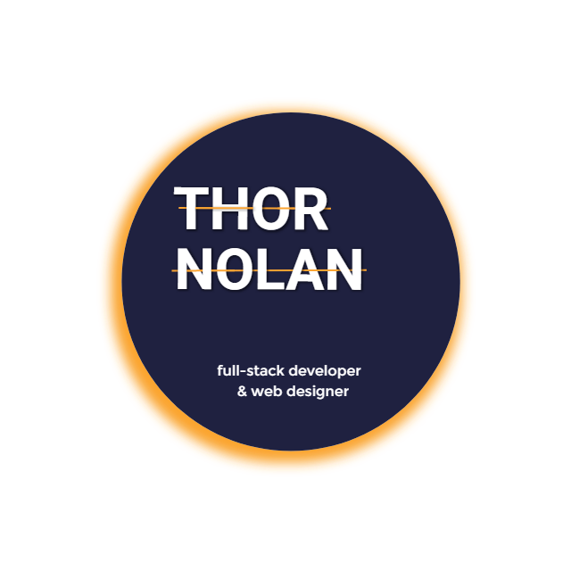

<h1 align="center">
  </a>
</h1>

👋 Welcome to the repository for all the code for my personal portfolio website. On the site you can easily find any and all information you may be looking for about me and my technical skill-set, as well as links to selected projects, my resume, and a number of means of getting in touch with me. The site is an ongoing labor of love, and I update it quite frequently, so check back for new designs as well as new projects that have been added!

[Click here to check it out!](https://thornolan.com/ "Deployed website")

## 🔧 Technologies Used

+ **HTML5** and **SCSS** (utilizing many CSS3 features) for page content and styling.

+ [JavaScript](https://www.javascript.com/) for a number site functionalities.
  
+ [jQuery](https://jquery.com/) library for some scroll based interactions.
  
+ [Materialize.css](https://materializecss.com/) library used minimally for grid system as well as some built-in components such as the floating action button (I am currently phasing this library out as I transition into using a flexbox grid in my SCSS).
  
+ [Particles.js](https://github.com/VincentGarreau/particles.js/) library to create the animated particle background, I customized the look and animation of the particles by adjusting JSON data that can be found in my main JS file.

+ [Parallax.js](https://matthew.wagerfield.com/parallax/) used for my eclipse scene to accomplish the gyroscopic effect based on either device orientation on a tablet or phone or cursor position on a desktop.
  
+ [ScrollReveal.js](https://scrollrevealjs.org/) lightweight library used on just a few components to reveal them based on user scroll position with simple css animations.

+ [Font-awesome](https://fontawesome.com) and [Material Icons](https://material.io/resources/icons/?style=baseline) for icons.

## 🔜 Plans for the Future

+ Add option for switching between a light and a dark theme, which I will accomplish with SCSS.

+ Overhaul projects section to have a "featured" project, and seperate my work for clients from my personal projects. 

## 🌌 Author 

Thor Nolan—https://github.com/ThorNolan
  

